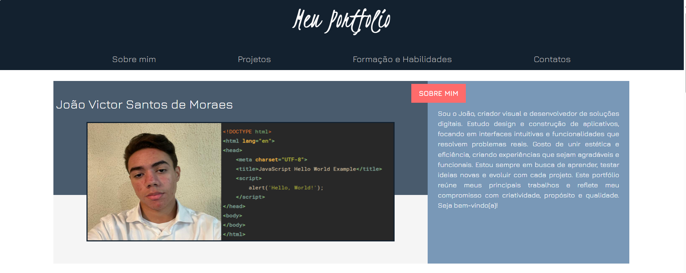

# Meu Portfólio
Este repositório contém o projeto do meu portfólio pessoal, desenvolvido para apresentar meus principais trabalhos, formação, habilidades técnicas e formas de contato. O objetivo é reunir em um só lugar minha trajetória como desenvolvedor e criador visual.

# Sobre o Projeto
O portfólio foi construído com foco em design intuitivo, funcionalidade prática e estética agradável. Ele reflete meu compromisso com soluções digitais que unem criatividade e propósito.

## Tecnologias Utilizadas
* HTML5
* CSS
* Figma